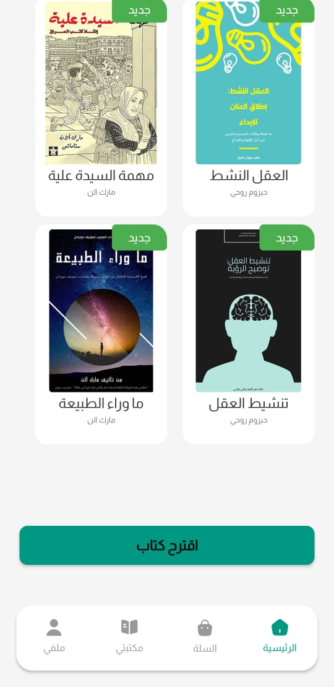
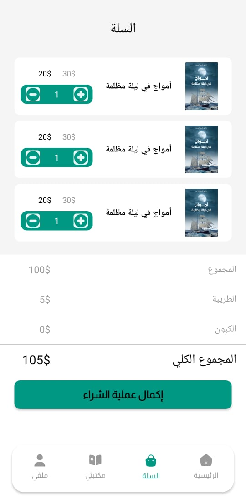

# BookStore — Final Project for Android

## Overview

The **BookStore** app displays a right-to-left Arabic UI, with a main feed (horizontal list + new book grid), a shopping cart, a personal library, and a profile screen. All content is sample data within the app, intended for UI/UX presentation.

## Features

* Full Arabic right-to-left UI in **Almarai** font.
* **Splash ← Login/Signup ← Main**.
* **MainActivity** hosts a bottom navigation bar and toggles the following parts:

* **HomeFragment**: Vertical cards with horizontal grid for new books.
* **CartFragment**: Shopping cart screen (UI structure, demo data).
* **MyLibFragment**: Personal library (UI structure, demo data).
* **ProfileFragment**: A simple profile screen.
* **SuggestedBook** to display additional suggestions.

* RecyclerView adapters: `CardBookAdapter`, `Card2BookAdapter`, `Card3BookAdapter`.

* Model: `Book` (title, author, price, quantity, rating, views, reads, description, image (base64))

## Application Structure

**Activities**

* `SplashActivity` (Trigger)
* `LoginActivity`, `SignupActivity`
* `MainActivity` (Hosts fragments via a container)
* `SuggestedBook`

**Fragments**

* `HomeFragment`, `CartFragment`, `MyLibFragment`, `ProfileFragment`

**Layouts (Specified)**

* `activity_login.xml`, `activity_signup.xml`, `activity_splash.xml`, `activity_main.xml`, `activity_suggested_book.xml`
* `fragment_home.xml`, `fragment_cart.xml`, `fragment_my_lib.xml` `fragment_profile.xml`
* `card_book.xml`, `card_book_header.xml`, `card_book_new.xml`

**Resources**

* `res/font/almarai.ttf`
* `res/drawable/*` Icon/Shapes/Images
* `res/values/{strings.xml, colors.xml, themes.xml, ids.xml}`
* `res/xml/{backup_rules.xml, data_extraction_rules.xml}`

**ScreenShots**

  
  
  
  

  
  
  
  

  
  
  

